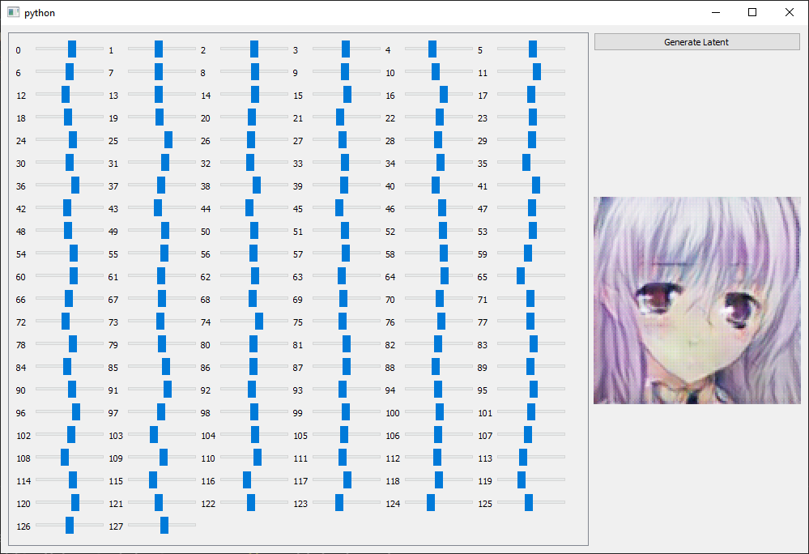

# LSGAN
My own implementation of LSGAN used to generate anime faces.
## Dataset
https://www.kaggle.com/splcher/animefacedataset
## Instructions
To train the LSGAN:
```Python
python train.py
```

To start the latent explorer:
```Python
python latent_explorer.py
```
## Samples
Generated images after 15 epochs of training.


## Latent Explorer
A GUI latent explorer written with PySide2.
